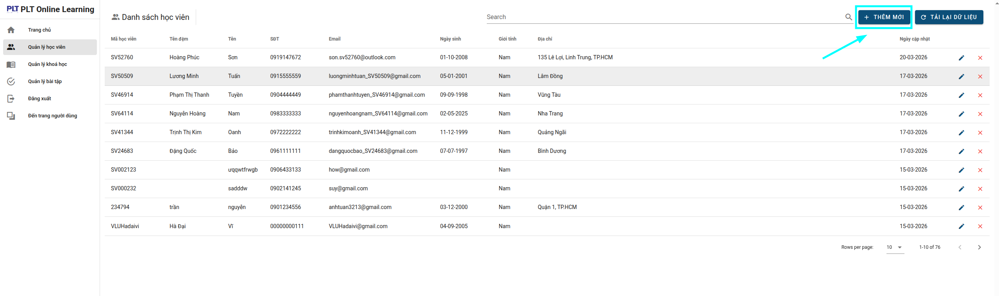
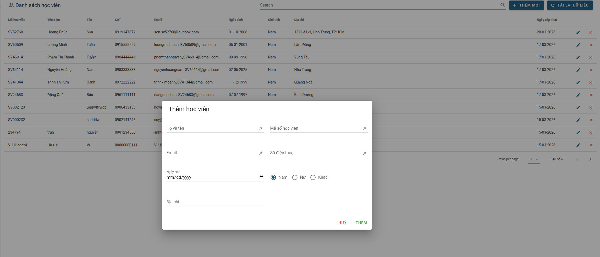
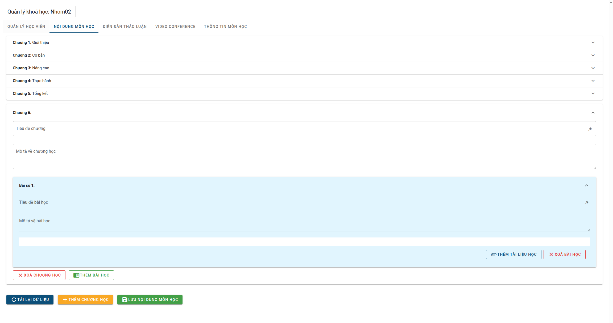

# PLT-Test

Selenium WebDriver + TestNG automation tests for the PLT e-learning platform, built with the **Page Object Model (POM)** design pattern.

## Project Structure

```
POL_Test/
├── pom.xml                          # Maven config & dependencies
├── testng.xml                       # TestNG suite configuration
│
├── src/
│   ├── base/
│   │   └── BaseTest.java            # WebDriver setup/teardown (@BeforeMethod/@AfterMethod)
│   │
│   ├── pages/
│   │   ├── LoginPage.java           # Login page — locators & actions
│   │   ├── StudentManagementPage.java  # Student CRUD — locators & actions
│   │   ├── CourseManagementPage.java   # Course admin — locators & actions
│   │   └── CourseContentPage.java      # Course content verify — locators & actions
│   │
│   ├── models/
│   │   ├── StudentInfo.java          # Student data model
│   │   ├── ChapterData.java          # Chapter data model
│   │   ├── ChapterInfo.java          # Chapter + lessons (for verification)
│   │   └── LessonData.java           # Lesson data model
│   │
│   ├── utils/
│   │   ├── SeleniumHelper.java       # Shared helpers (safeClick, fill, delay...)
│   │   └── DataLoader.java           # CSV/JSON test data loading & random generation
│   │
│   ├── tests/
│   │   ├── admin/
│   │   │   └── StudentManagementTest.java  # Student CRUD workflow test
│   │   └── user/
│   │       ├── AddingCourseTest.java       # Add chapter & lessons test
│   │       └── CourseExpandTest.java       # Expand & verify course content test
│   │
│   └── resources/
│       ├── vietnamese_names.csv      # Random Vietnamese name data
│       ├── vietnamese_locations.csv  # Random address data
│       ├── chapters.json             # Chapter test data
│       ├── lessons.json              # Lesson test data
│       └── data.txt                  # Expected course content for verification
│
└── test-reports/                     # Generated test logs & comparison files
```

## Architecture (Page Object Model)

```
┌──────────────┐     ┌──────────────┐     ┌──────────────┐
│   Tests      │────>│    Pages     │────>│   Models     │
│ (test flow   │     │ (locators +  │     │ (data POJOs) │
│  & asserts)  │     │  actions)    │     │              │
└──────┬───────┘     └──────────────┘     └──────────────┘
       │
       ▼
┌──────────────┐     ┌──────────────┐
│  BaseTest    │     │    Utils     │
│ (driver      │     │ (helpers +   │
│  lifecycle)  │     │  data loader)│
└──────────────┘     └──────────────┘
```

- **Tests** contain only test flow and assertions — no locators, no raw Selenium calls
- **Pages** own all locators and page-specific actions for a single page/section
- **Models** are plain data objects passed between layers
- **BaseTest** manages ChromeDriver creation and cleanup for every test method
- **Utils** provide shared Selenium helpers and test data loading

## Prerequisites

- Java 17+
- Maven 3.8+
- Google Chrome browser

## How to Run

Run all tests:
```bash
mvn test
```

Run a specific test class:
```bash
mvn test -Dtest=tests.admin.StudentManagementTest
mvn test -Dtest=tests.user.AddingCourseTest
mvn test -Dtest=tests.user.CourseExpandTest
```

## Test Descriptions

| Test | Description |
|------|-------------|
| `StudentManagementTest` | Full CRUD — add student with random data, verify, edit address, verify, delete, verify gone |
| `AddingCourseTest` | Select random course, add a chapter with 2 lessons, save, verify they exist |
| `CourseExpandTest` | Expand all chapters/lessons, compare against expected data file, log results |

## Test Reports

- TestNG HTML report: `test-output/index.html`
- Surefire reports: `target/surefire-reports/`
- CourseExpandTest logs: `test-reports/CourseExpandTest_ddMMyy_XX.txt`


## Screenshots

### Login Page

> URL: https://elearning.plt.pro.vn/dang-nhap?redirect=%2Ftrang-chu


### Add New Student




### Add New Lessons


